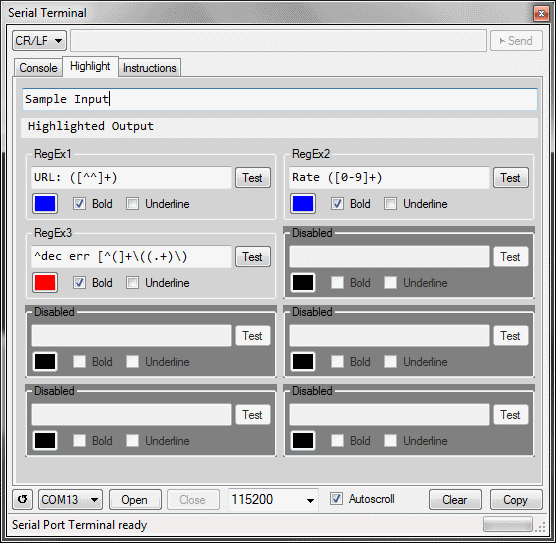

# SerialTerminal
COM port terminal with RegEx filter highlighting
Visual Studio Project

# Pictures
Configure Regular expression highlight of incommming data

Highlights in action

# Instructions

Right clicking on the tab, enables/disables filter application

